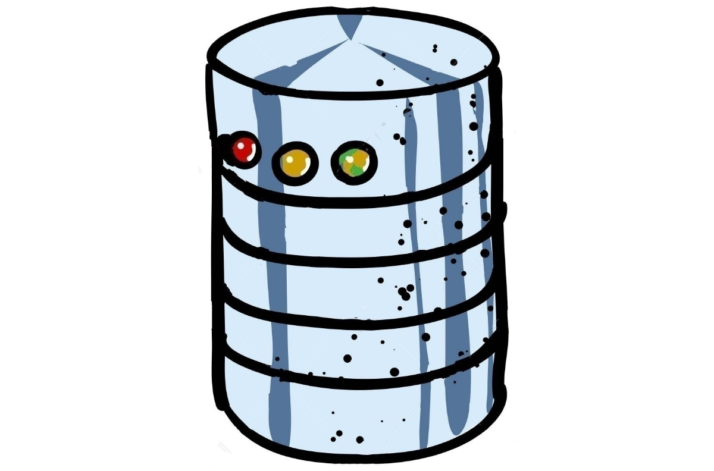

<!-- Improved compatibility of back to top link: See: https://github.com/othneildrew/Best-README-Template/pull/73 -->

<!--
*** Thanks for checking out the Best-README-Template. If you have a suggestion
*** that would make this better, please fork the repo and create a pull request
*** or simply open an issue with the tag "enhancement".
*** Don't forget to give the project a star!
*** Thanks again! Now go create something AMAZING! :D
-->

<!-- PROJECT SHIELDS -->
<!--
*** I'm using markdown "reference style" links for readability.
*** Reference links are enclosed in brackets [ ] instead of parentheses ( ).
*** See the bottom of this document for the declaration of the reference variables
*** for contributors-url, forks-url, etc. This is an optional, concise syntax you may use.
*** https://www.markdownguide.org/basic-syntax/#reference-style-links
*** https://dev.to/envoy_/150-badges-for-github-pnk#skills
*** https://github.com/Envoy-VC/awesome-badges
-->
[![Contributors][contributors-shield]][contributors-url]
[![Forks][forks-shield]][forks-url]
[![Stargazers][stars-shield]][stars-url]
[![Issues][issues-shield]][issues-url]

<!-- PROJECT LOGO -->
 

  

<h3 align="center">Spring DB Starter</h3>

  

    Learning - Spring JPA Project
     
    <a href="https://github.com/BobbyShaftoe/spring-dbstarter"><strong>Explore the docs »</strong></a>
     
     
    <a href="https://github.com/BobbyShaftoe/spring-dbstarter/issues">Report Bug</a>
    ·
    <a href="https://github.com/BobbyShaftoe/spring-dbstarter/issues">Request Feature</a>
  

<!-- TABLE OF CONTENTS -->

  
Table of Contents

  <ol>
    <li>
      <a href="#about-the-project">About The Project</a>
      <ul>
        <li><a href="#built-with">Built With</a></li>
      </ul>
    </li>
    <li>
      <a href="#getting-started">Getting Started</a>
      <ul>
        <li><a href="#prerequisites">Prerequisites</a></li>
        <li><a href="#installation">Installation</a></li>
      </ul>
    </li>
    <li><a href="#usage">Usage</a></li>
    <li><a href="#roadmap">Roadmap</a></li>
    <li><a href="#contributing">Contributing</a></li>
    <li><a href="#license">License</a></li>
    <li><a href="#contact">Contact</a></li>
    <li><a href="#acknowledgments">Acknowledgments</a></li>
  </ol>

<!-- ABOUT THE PROJECT -->

## About The Project

[![Product Name Screen Shot][product-screenshot]](https://spring.io/projects/spring-data-jpa)

Spring Data JPA, part of the larger Spring Data family, makes it easy to easily implement JPA based repositories. This
module deals with enhanced support for JPA based data access layers. It makes it easier to build Spring-powered
applications that use data access technologies.

(<a href="#readme-top">back to top</a>)

### Built With

* [![Java][Java]][Java-url]
* [![Spring][Spring]][Spring-url]
* [![PostgreSQL][PostgreSQL]][PostgreSQL-url]

(<a href="#readme-top">back to top</a>)

<!-- GETTING STARTED -->

## Getting Started

Clone this project, look at it, play with it, extend it

### Prerequisites

#### You need:

* String Initializer project
* Postgres DB up and running

### Installation

1. Create a String Initializer project
    * https://start.spring.io/
2. Download and install Postgres DB
    * https://www.postgresql.org/download/

(<a href="#readme-top">back to top</a>)

<!-- USAGE EXAMPLES -->

## Usage

$ mvn clean build

OR

Run the Spring service within your IDE

(<a href="#readme-top">back to top</a>)

<!-- ROADMAP -->

## Roadmap

- [X] Entity
- [ ] Repository
- [ ] Controller
    - [ ] Read
    - [ ] Update

See the [open issues](https://github.com/BobbyShaftoe/spring-dbstarter/issues) for a full list of proposed features (and
known issues).

(<a href="#readme-top">back to top</a>)

<!-- CONTRIBUTING -->

## Contributing

Contributions are what make the open source community such an amazing place to learn, inspire, and create. Any
contributions you make are **greatly appreciated**.

If you have a suggestion that would make this better, please fork the repo and create a pull request. You can also
simply open an issue with the tag "enhancement".
Don't forget to give the project a star! Thanks again!

1. Fork the Project
2. Create your Feature Branch (`git checkout -b feature/AmazingFeature`)
3. Commit your Changes (`git commit -m 'Add some AmazingFeature'`)
4. Push to the Branch (`git push origin feature/AmazingFeature`)
5. Open a Pull Request

(<a href="#readme-top">back to top</a>)

<!-- LICENSE -->

## License

Distributed under the MIT License. See `LICENSE.txt` for more information.

(<a href="#readme-top">back to top</a>)

<!-- MARKDOWN LINKS & IMAGES -->
<!-- https://www.markdownguide.org/basic-syntax/#reference-style-links -->

[contributors-shield]: https://img.shields.io/github/contributors/BobbyShaftoe/spring-dbstarter.svg?style=for-the-badge

[contributors-url]: https://github.com/BobbyShaftoe/spring-dbstarter/graphs/contributors

[forks-shield]: https://img.shields.io/github/forks/BobbyShaftoe/spring-dbstarter.svg?style=for-the-badge

[forks-url]: https://github.com/BobbyShaftoe/spring-dbstarter/network/members

[stars-shield]: https://img.shields.io/github/stars/BobbyShaftoe/spring-dbstarter.svg?style=for-the-badge

[stars-url]: https://github.com/BobbyShaftoe/spring-dbstarter/stargazers

[issues-shield]: https://img.shields.io/github/issues/BobbyShaftoe/spring-dbstarter.svg?style=for-the-badge

[issues-url]: https://github.com/BobbyShaftoe/spring-dbstarter/issues

[product-screenshot]: images/spring-jpa.png

[Java]: https://img.shields.io/badge/Java-ED8B00?style=for-the-badge&logo=openjdk&logoColor=white

[Java-url]: https://openjdk.org/

[Spring]: https://img.shields.io/badge/Spring-6DB33F?style=for-the-badge&logo=spring&logoColor=white

[Spring-url]: https://start.spring.io/

[PostgreSQL]: https://img.shields.io/badge/PostgreSQL-316192?style=for-the-badge&logo=postgresql&logoColor=white

[PostgreSQL-url]: https://www.postgresql.org/